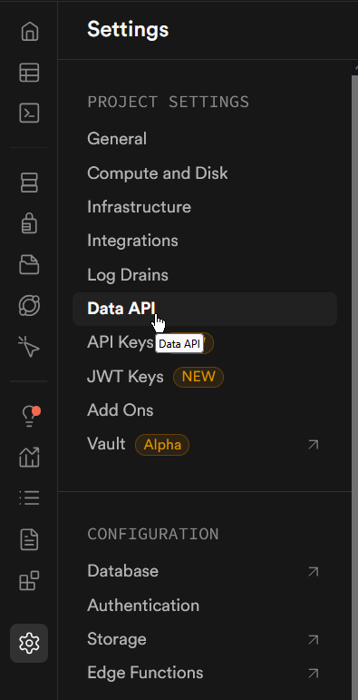
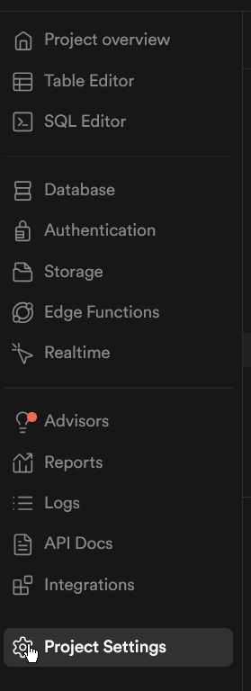
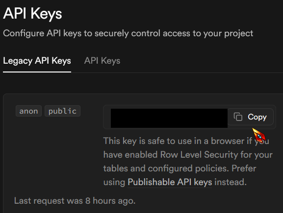
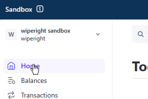
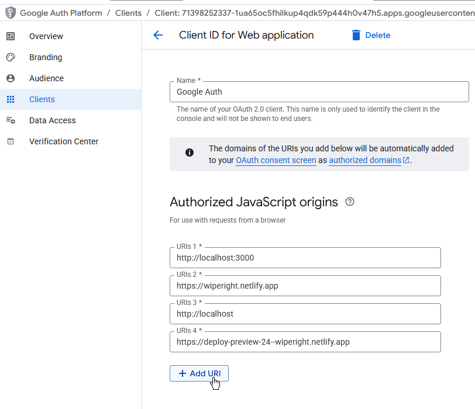

# 🧼 Welcome to Wipe Ripe – FrontEnd (Next.Js)

This is the Frontend for the Wipe Right project, built with **FastAPI**, **SQLModel**, and **Supabase**. It supports customer and provider accounts, service listings, bookings, and more.

Did you mean to checkout our backend repository?

Check out our twin here:

## 📚 Table of Contents

- [⚡ Quickstart](#-quickstart)
- [🆕 First-Time Setup](#-first-time-setup)
  - [🔐 Configure Environment Variables](#-configure-environment-variables)
- [🧰 Prerequisites & Tooling](#-prerequisites--tooling)
- [🧱 Code Style & Formatting](#-code-style--formatting)
- [🧯 Troubleshooting](#-troubleshooting)

## ⚡ Quickstart

Already cloned the repo and set up your `.env`?

Just run:
`npm run dev`

## 🆕 First-Time Setup

1. Clone repo to your device
2. Cd into folder
3. Make a .env folder in the root directory, use the .env.example as a scaffold to put in your personal env variables
4. Run npm install to download dependencies
5. Run npm run dev to start dev server
6. Navigate to localhost:3000 to view app

That's it!

### 🔐 Configure Environment Variables

We use a `.env` file to manage secrets and environment-specific settings. You can use the .env.example file as a scaffold

NEXT_PUBLIC_GOOGLE_CLIENT_ID = longStringOfNumbersAndLetters.apps.googleusercontent.com

- go to https://console.cloud.google.com/

- select clients

- Click copy Oauth Client, this is the client ID for this env variable

NEXT_PUBLIC_SUPABASE_URL = url

- Click the cog icon on the bottom left to get to settings, then click Data API
  

- Click the copy icon, then paste the url in your env file

NEXT_PUBLIC_SUPABASE_ANON_KEY =longStringOfNumbersAndLetters

- needed for the supabase.ts file

- select project settings
  

- click to copy icon, this is what you need for this env variable

NEXT_PUBLIC_URL = http://localhost:3000

- this will be the url you'll use for testing, so it will likely be localhost:3000. On the deployment itself (ex netlify) this will updated to the actual frontend name

NEXT_PUBLIC_STRIPE_PUBLIC_KEY=pk_test_longStringOfNumbersAndLetter

- login to stripe

- click home

- to the right you'll see the api keys, click to copy the string

NEXT_PUBLIC_API_BASE_URL = url

- this will depend on your backend, copy and paste the backend's deploy url here

## 🧰 Prerequisites & Tooling

This project assumes you're using **VS Code** as your editor.

### 💻 VS Code Extensions

- (Optional but strongly recommended) Prettier
  - an opinionated code formatter.
  - https://marketplace.visualstudio.com/items?itemName=esbenp.prettier-vscode
  - If you don't use it then manually run either:
    `format": "prettier --write .` to automatically have prettier make the recommended adjustments
    `format:check": "prettier --check .` have prettier tell you it's recommendations, and then manually make the adjustments

- (Optional but strongly recommended) ESLint
  - Integrates ESLint into VS Code. Lints your code to identify possible problematic coding patterns that violate coding standards.
  - https://marketplace.visualstudio.com/items?itemName=dbaeumer.vscode-eslint
  - If you don't use it then manually run:
    `lint": "next lint` runs eslint.
  - However, you would need the plugin to see eslint as-you-type in VSCode.

- (Optional) Tailwind CSS IntelliSense
  - Enhances the Tailwind development experience by providing Visual Studio Code users with advanced features such as autocomplete, syntax highlighting, and linting.
  - https://marketplace.visualstudio.com/items?itemName=bradlc.vscode-tailwindcss

- (Optional) Rainbow Tags
  - Inteligently colors all tag pairs in your file. Helps with debugging missing: {}().
    https://marketplace.visualstudio.com/items?itemName=voldemortensen.rainbow-tags

## Deployments

If you need the login function to work with the test deployment you'll have to add the preview deployment to google console

go to https://console.cloud.google.com/

select clients

click edit OAuth Client

Add the deploy preview link to authorized JavaScript Origins, then scroll down and click save. You don't need to add it to the redirect section below the Authorized JavaScript Origins.

## 🧯 Troubleshooting

If you get a bug that doesn't occur when you test on another machine then you likely will need to

- delete node_modules
- re-run npm install

If you get a bug where the code doesn't match what's rendered, try:

- deleting .next
- rerun npm run build

| Symptom                                                         | Likely Culprit                               | Why Nuking Helps                   |
| --------------------------------------------------------------- | -------------------------------------------- | ---------------------------------- |
| **Code changes not showing up in browser**                      | Stale `.next` cache                          | Forcing full rebuild fixes it      |
| **Hydration mismatch warnings (server vs client DOM mismatch)** | Old build artifacts                          | Removes cached pages/components    |
| **Hot reload not working**                                      | Corrupted `.next`                            | Fresh cache lets HMR work properly |
| **Random `Cannot find module 'X'`**                             | Broken or missing dependency                 | Reinstalls fresh modules           |
| **Next.js dev server crashes immediately**                      | Corrupted cache or bad dependency resolution | Rebuilds with clean slate          |
| **TypeScript showing phantom errors**                           | Old `.d.ts` files in `node_modules`          | Cleans stale types                 |
| **Different behavior locally vs Vercel**                        | Stale local `.next` build                    | Matches fresh build behavior       |
| **Static images or CSS not updating**                           | Cached assets in `.next`                     | Forces re-generation               |
